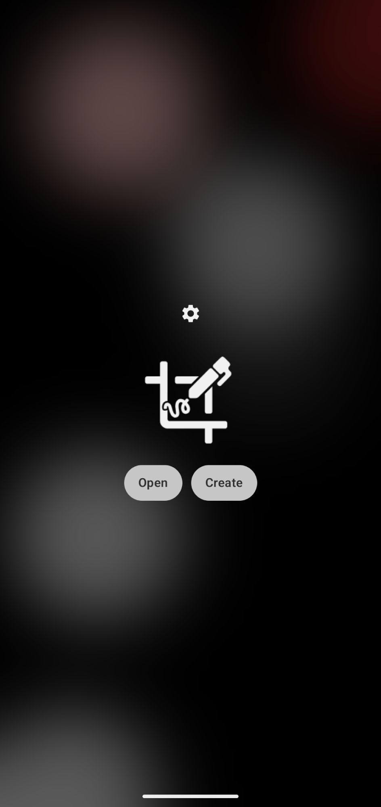
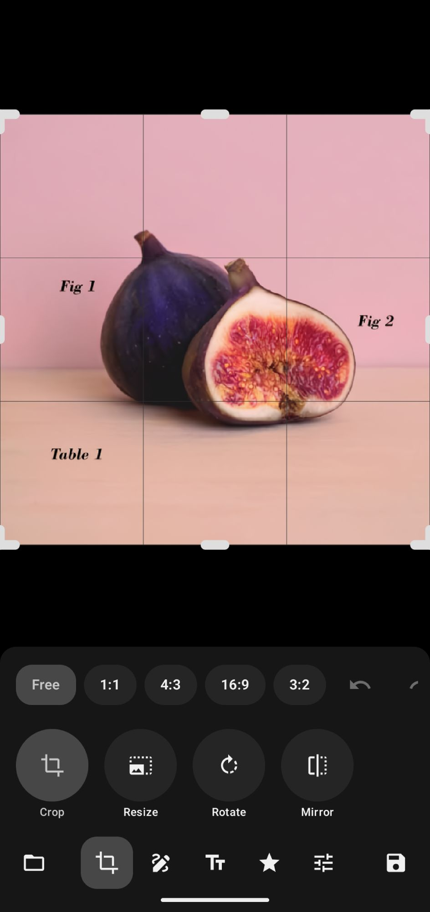
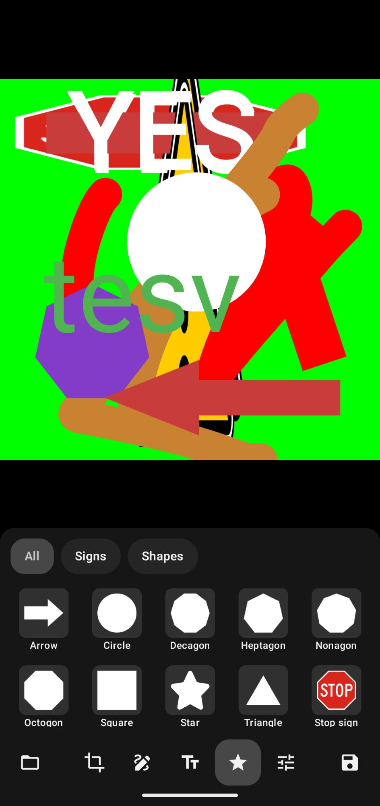
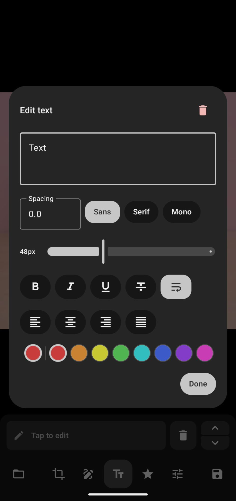

an opinionated photo editor for Android 6+

<p>




</p>

## features

- crop/rotate/mirror/flip (lossless¹)
- draw/add text
- stickers
- adjust (invert, saturation, hue, etc)
- overwrite
- metadata/exif supported

## FAQ

Q: Why? Theres X app that already does this

A: Because opinionated (see info²)

## credits

loosely inspired from Samsung Gallery

https://github.com/k3b/LosslessJpgCrop

## info

<!-- https://github.com/mplough/mcutool -->
¹lossless cropping and rotation is available for JPEG images, but it has limitations. furthermore, images that aren't [MCU aligned](https://web.archive.org/web/20100413201700/https://www.impulseadventure.com/photo/jpeg-minimum-coded-unit.html) will be cut off at their closest unit. mirroring/flipping is not yet supported. lossless WebP transforming isn't either.

²Samsung's photo editor supported saving edited photos and keeping the same date/time afterward (among other things) and since I don't use Samsung and I couldn't find a decent alternative, now exists yet another app to clutter my phone with.

AI disclosure: LLMs were used in a review/assisted capacity and marked where so in comments

## building

clone repo (with submodules, libjpeg-turbo):

```bash
git clone --recursive https://github.com/jeeneo/edit.git
```

and normal gradle build. you can also build on [termux.md](./termux/readme.md)

---

Licensed under MIT

```
Permission is hereby granted, free of charge, to any person obtaining a copy
of this software and associated documentation files (the "Software"), to deal
in the Software without restriction, including without limitation the rights
to use, copy, modify, merge, publish, distribute, sublicense, and/or sell
copies of the Software, and to permit persons to whom the Software is
furnished to do so, subject to the following conditions:

The above copyright notice and this permission notice shall be included in all
copies or substantial portions of the Software.

THE SOFTWARE IS PROVIDED "AS IS", WITHOUT WARRANTY OF ANY KIND, EXPRESS OR
IMPLIED, INCLUDING BUT NOT LIMITED TO THE WARRANTIES OF MERCHANTABILITY,
FITNESS FOR A PARTICULAR PURPOSE AND NONINFRINGEMENT. IN NO EVENT SHALL THE
AUTHORS OR COPYRIGHT HOLDERS BE LIABLE FOR ANY CLAIM, DAMAGES OR OTHER
LIABILITY, WHETHER IN AN ACTION OF CONTRACT, TORT OR OTHERWISE, ARISING FROM,
OUT OF OR IN CONNECTION WITH THE SOFTWARE OR THE USE OR OTHER DEALINGS IN THE
SOFTWARE.
```
